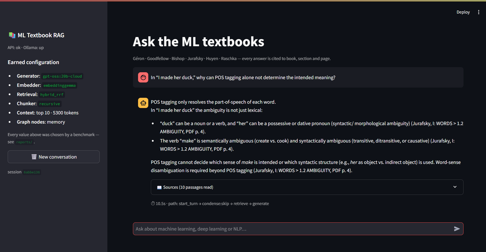
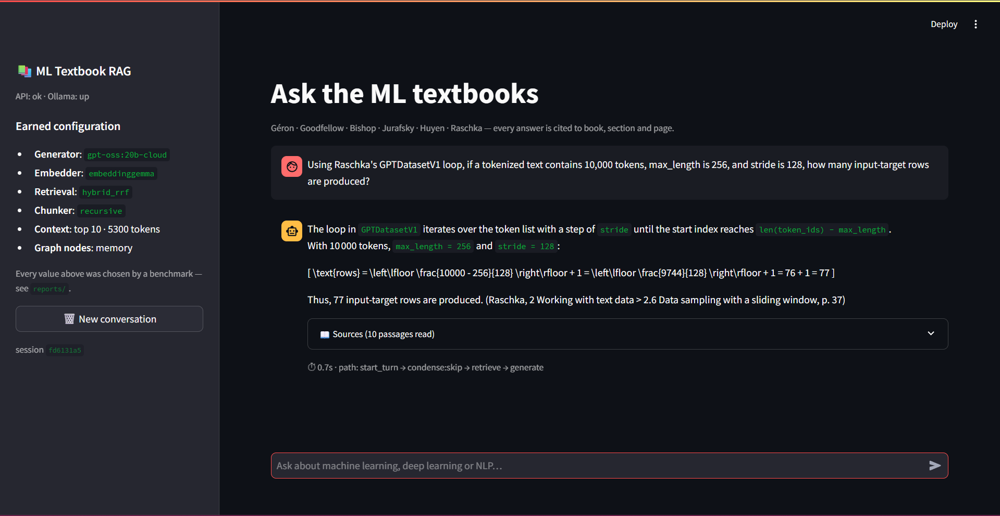
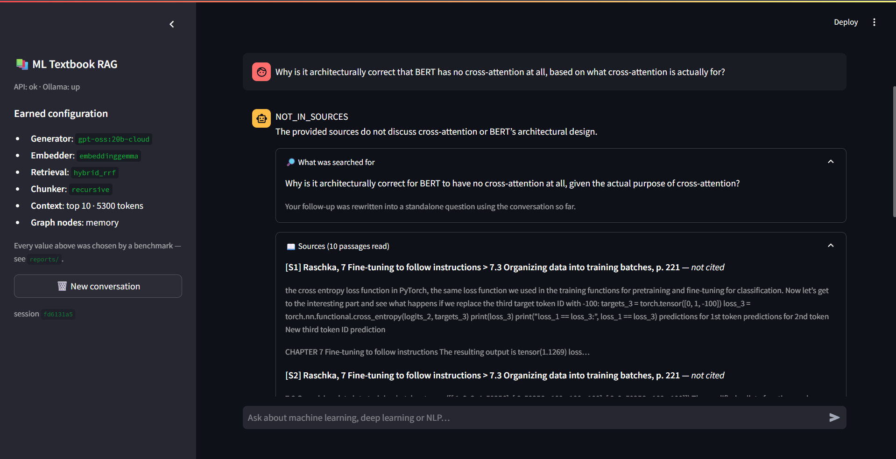
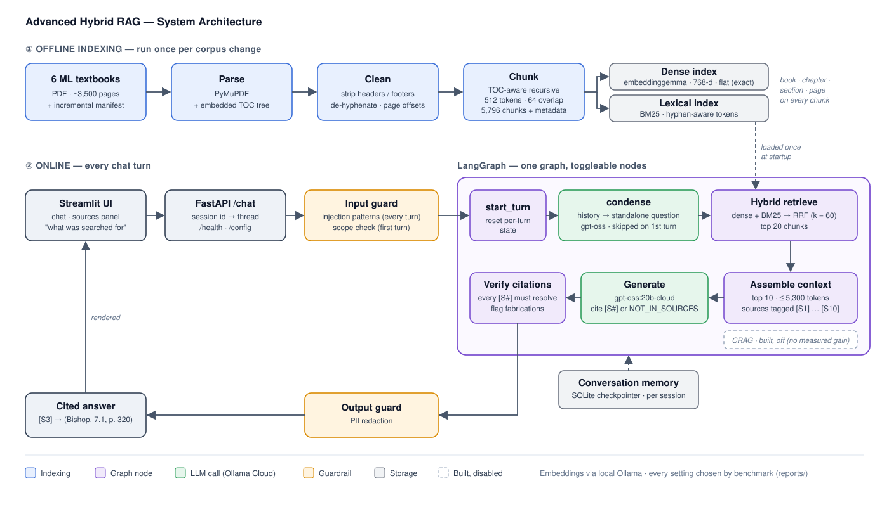

# Advanced Hybrid RAG Chatbot

A retrieval-augmented chatbot over six machine-learning textbooks — built so that **every
architectural decision is measured rather than assumed**.

Most RAG projects pick a chunker, an embedder and a vector store on the first day and never
revisit them. This one treats each of those as an open question, benchmarks the alternatives
against a hand-labelled golden dataset, and ships the winner. The tables below are the
project; the chatbot is what falls out of them.

Every served setting traces to a numbered report in [`reports/`](reports). To run it, see
[Setup and installation](#setup-and-installation) and [How to run](#how-to-run).

## Demo


**Every claim is cited to book, section and page.** Asked why part-of-speech tagging alone
cannot resolve Jurafsky's *"I made her duck"*, the answer separates the lexical, syntactic
and semantic ambiguities and cites each claim to *Jurafsky, 1.2 Ambiguity, PDF p. 4*. The
footer shows the path the request took through the graph
(`start_turn → condense:skip → retrieve → generate`) and its end-to-end latency (10.5 s).


**Numerical reasoning, grounded in the source.** For Raschka's `GPTDatasetV1` sliding window
(10,000 tokens, `max_length` 256, `stride` 128) the answer works out 77 input–target rows
and cites *§2.6 Data sampling with a sliding window, p. 37*. The sidebar lists the
configuration the server is running; each value was chosen by a benchmark. (0.7 s: this
answer was served from the response cache.)


**Declining instead of guessing.** Here the retrieved passages did not address the question
(they are listed under *Sources*, none cited), so the model answered `NOT_IN_SOURCES`
rather than falling back on general knowledge. The *What was searched for* panel shows the
standalone query produced by history-aware rewriting.

---

## Corpus

| Book | Author |
|---|---|
| Hands-On Machine Learning with Scikit-Learn, Keras & TensorFlow | Aurélien Géron |
| Deep Learning | Goodfellow, Bengio, Courville |
| Speech and Language Processing | Jurafsky & Martin |
| Pattern Recognition and Machine Learning | Christopher Bishop |
| Designing Machine Learning Systems | Chip Huyen |
| Build a Large Language Model (From Scratch) | Sebastian Raschka |

~3,500 pages of equation-dense technical text. PDFs are **not** distributed with this repo.

---

## Results

*Populated as each phase completes. Empty cells are honest — they mean "not yet measured".*

### Every decision, and what earned it

| | Decision | Evidence |
|---|---|---|
| D1 parser | `pymupdf` | pdfplumber collapsed word boundaries — **no metric caught it**; the human veto did |
| D2 chunker | `recursive` | all 3 strategies measured, **none significant** (239–243/250 ties); chosen on build cost |
| D3 embedder | `embeddinggemma` | +4 MRR over nomic/mxbai under hybrid (p≤0.004); ties bge-m3, wins every cost axis |
| D4 index | `flat` | HNSW is lossless *and* 7.6× faster — flat kept as the zero-error measurement instrument |
| D5 retrieval | `hybrid_rrf` | **+5.3 MRR, p<0.0001** vs dense |
| D6 reranker | **none** | +4.2 recall@1 for 1–6 s/query; inside the noise band |
| D9 generator | `gpt-oss:20b-cloud` | faithfulness 0.87 vs llama3.2:3b 0.70; 6.6 s vs 61 s |
| context | top 10, ~5.3k tokens | wrong refusals 5 → 2 |
| graph | **memory** only | turn-2 recall 0.083 → 0.917; decomposition rejected |

Significance throughout is **paired** (bootstrap + sign test, Bonferroni-corrected) —
every config answers the same questions, so "on how many did A beat B" is the test.

### Retrieval mode — D5 · [full report](reports/04c_hybrid_retrieval.md)

| Config (embeddinggemma, n=250) | Recall@10 | MRR |
|---|---:|---:|
| **hybrid_rrf** ✅ | 0.964 | **0.833** |
| hybrid_weighted | 0.964 | 0.847 |
| dense | 0.944 | 0.780 |
| bm25 | 0.920 | 0.777 |

**A headline that did not survive.** Measured first with the weaker `nomic` embedder,
hybrid beat dense by **+11.8 recall@10**. Re-run on the D3 winner, the recall gain
**vanishes** (p=0.18, 241/250 ties). What survives is ranking: hybrid beats *both* of
its own arms on MRR by ~5 points (p<0.0001). Fusion stops finding more once dense is
good — it keeps ordering better.

**BM25 alone beat dense** under nomic: technical textbooks are full of tokens that must
match literally (`ReLU`, `AdaGrad`, `CKY`), and dense embeddings place `Adam` near
`RMSProp`. RRF vs weighted is a genuine tie (twice failed significance); RRF wins on
having no free parameter.

### Reranking — D6 · [full report](reports/04d_reranking.md)

Cross-encoder over the fused top-20. Stage 1 pinned to `hybrid_rrf`.

| Reranker | Recall@1 | Recall@10 | Recall@20 | MRR | nDCG@10 | Rerank p50 |
|---|---:|---:|---:|---:|---:|---:|
| none | 0.4653 | 0.8229 | 0.8438 | 0.6510 | 0.6930 | — |
| minilm-l6 | 0.4965 | *0.7951* | 0.8438 | 0.6863 | 0.7063 | 3,019 ms |
| minilm-l12 | **0.5069** | **0.8333** | 0.8438 | **0.6887** | **0.7147** | 5,786 ms |

**A second prior falsified.** We predicted reranking would be the biggest
single quality win. It isn't — hybrid fusion (+11.8 recall@10) beat it by
nearly 3× and cost +40 ms instead of +3,000 ms. **Not adopted**: a +4.2 gain
sits inside the ~5-point noise band at n=48, and 1–6 seconds per query is not
a price worth paying for it on CPU-only hardware. Revisit on the 250-item
synthetic set, where the power exists to tell +4 from 0.

**`recall@20` is identical in all three rows** — the reranker reorders stage
1's pool rather than retrieving anything new, so stage 1's recall@20 is the
hard ceiling on this entire stage.

**A reranker can make things worse.** `minilm-l6` improves recall@1 by +3.1
*and degrades recall@10 by −2.8*. Reordering a fixed pool is zero-sum:
promoting one document demotes another, and a 22M-parameter model is confident
enough to push a relevant chunk past rank 10. Its value therefore depends on
how many documents the generator actually reads — which couples D6 to the
Phase 5 context budget.

### ANN index — D4 · [full report](reports/04a_ann_lab.md)

5,796 chunks, 200 probe queries. Recall here is measured against **exact
search**, not human labels — it answers *what does approximation cost*.

| Index | Recall@10 | p50 | Memory |
|---|---:|---:|---:|
| **flat** ✅ | 1.0000 | 1.046 ms | 17.8 MB |
| hnsw | 1.0000 | **0.138 ms** | 19.4 MB |
| ivf | 0.9885 | 0.105 ms | 18.3 MB |
| ivfpq | 0.7995 | 0.561 ms | **1.7 MB** |

**A prior that failed.** We predicted flat would win outright at this scale. It
didn't — HNSW is *lossless* here and 7.6× faster. Flat is still chosen, for a
different reason than predicted: the 0.9 ms saving is under 0.1% of end-to-end
latency, and flat contributes **zero approximation error** while it serves as
the measurement instrument for every other Phase 4 experiment. Revisit at
~100k–250k chunks.

`ivfpq` is rejected on two counts — lossy *and* slower than exact search. Its
64 sub-quantizers each need 256 centroids from 5,796 vectors (~23 points per
centroid against a recommended ≥39), so the codebooks are undertrained. PQ is
a technique for tens of millions of vectors.

### Retrieval quality by question type

Golden set, recall@10, first with the initial retriever (nomic, dense only) and then with the
served configuration (embeddinggemma + hybrid RRF):

| Type | n | initial | served |
|---|---:|---:|---:|
| multi_hop | 4 | 0.375 | 0.500 |
| comparison | 5 | 0.400 | 0.900 |
| synthesis | 5 | 0.467 | 0.700 |
| factual | 6 | 0.667 | 1.000 |
| numerical | 6 | — | 0.833 |
| explanation | 10 | 0.900 | 0.900 |
| definition | 5 | 1.000 | 1.000 |
| specific_source | 5 | 1.000 | 1.000 |

The weakest types are the ones that need evidence from **several passages**. Better retrieval
lifted comparison and synthesis substantially. **Multi-hop remains the open weakness**: query
decomposition was built to target it and made it worse (see below). Cells hold 4–10 questions,
so treat them as indicative.

### Generation (Phase 5) · [report](reports/05_generators.md)

| Model | usable | faithfulness | cites dumped up front | p50 latency |
|---|---:|---:|---:|---:|
| **gpt-oss:20b-cloud** ✅ | 0.76 | **0.87**¹ | **0/36** | **6.6 s** |
| llama3.2:3b | **1.00** | 0.70 | 37/48 | 61 s |
| phi4-mini | 0.68 | 0.55 | 19/35 | 73 s |
| qwen3:4b | **0.00** | — | — | ~330 s |

Each measurement layer changed who looked best. `grounded_rate` rated qwen3:4b perfect —
it was 14 truncated reasoning monologues that "cited" `[S1]`. `usable` rated llama3.2:3b
perfect — until the faithfulness judge found 29% of its answers carried an unsupported
citation, and a regex (no judge) showed why: it prepends every source tag instead of
attaching each to its claim. ¹ Judged by gpt-oss:120b, the same family. **Validated
against blind human labels** ([report](reports/08_judge_validation.md)): no
self-preference (κ 0.815 on gpt-oss answers); the judge was instead *lenient toward
llama*. By human labels the gap is wider: **gpt-oss 0.90, llama3.2:3b 0.50**.

### RAG control flow (Phase 6)

| Configuration | recall@10 | multi-passage recall | usable |
|---|---:|---:|---:|
| **baseline** (retrieve → generate) | **0.854** | **0.714** | **0.80** |
| + decompose (llama3.2:1b) | 0.726 | 0.488 | 0.74 |
| + decompose (llama3.2:3b) | 0.722 | — | 0.76 |
| + decompose (3b) + keep original | 0.774 | 0.655 | 0.72 |
| + CRAG (grade top 5, rewrite once) | 0.854 | 0.714 | 0.76 |

**CRAG had no effect** (0W/0L/48T on recall): its grader marked all five passages
irrelevant on 18 questions whose retrieval was already perfect — probably because it sees
only the first 400 characters of each chunk. Fusing the rewrite with the original query,
rather than replacing it, is why those needless rewrites cost latency but no recall.

**Decomposition is a negative result.** Both small models split 49/50 questions,
ignoring the rule to leave single-topic ones whole; the 1B also swapped topics ("Markov
blanket" → "Markov chain") and invented entities.

| Memory | turn-2 recall@10 on pronoun follow-ups |
|---|---:|
| off | 0.083 |
| **on** (history-aware condensation) | **0.917** |

### Guardrails (Phase 7) · [report](reports/07_guardrails.md)

Deterministic by design. Injection: **10/10 caught, 0 false positives** on 300 real
questions. Scope (similarity to the corpus, threshold calibrated on data): blocks **0/50**
golden and 2/250 held-out questions, catches 15/20 off-topic prompts — the rest are
declined by the answer prompt's `NOT_IN_SOURCES` rule.

## Skipped or deferred — and why

| Item | Status | Why |
|---|---|---|
| **Decomposition / multi-hop** | rejected | 3 configs, all below baseline (above) |
| **CRAG** | built, not enabled | no gain (above); one config line turns it on |
| **Adaptive router** | deferred | depends on a small model deciding "does this question need X?" — the exact judgement both small models failed 100% of the time for decomposition |
| **Self-RAG answer grading** | deferred | its cheap form is already live: `citations.py` verifies every `[S<n>]` and the API flags fabrications |
| **Reranker** | rejected | +4.2 recall@1 inside the noise band, 1–6 s/query on CPU |
| **HyDE / query expansion** | skipped | small models drifted when rewriting; not worth a third rewrite experiment |
| **Toxicity guard** | gap | `llama-guard3:1b` failed to download (IPv6); not substituted |
| **PII via Presidio** | substituted | regex for email/phone/card; misses names and addresses |
| **Token streaming** | deferred | answers arrive whole (~7 s); UI shows a spinner |
| **LangSmith tracing** | optional | needs an API key; the graph `trace` field shows each turn's path |
| **Fine-tuning (Phase 10)** | deferred | retrieval recall@10 is already 0.964 on the synthetic set; the plan says fine-tune only if justified |
| **gemma3:4b** | unavailable | pull failed (IPv6); three other local generators compared |

---

## Architecture



**Offline**, the six PDFs are parsed with PyMuPDF (using each book's embedded table of
contents), cleaned, and cut into 5,796 TOC-aware chunks, each tagged with book, chapter,
section and page. The chunks are indexed twice: dense (embeddinggemma vectors, exact search)
and lexical (BM25).

**On every chat turn**, the FastAPI server screens the message (prompt-injection patterns on
every turn, a scope check on a session's first turn) and runs a LangGraph graph:

1. **start_turn**: reset the per-turn state carried by the checkpointer.
2. **condense**: rewrite a follow-up such as *"why does it work better?"* into a standalone
   question using the conversation history (skipped on the first turn).
3. **hybrid retrieve**: dense and BM25 rankings fused with Reciprocal Rank Fusion, top 20.
4. **assemble**: the top 10 chunks (at most 5,300 tokens) become numbered sources `[S1]…[S10]`.
5. **generate**: gpt-oss:20b must cite `[S#]` for every claim or answer `NOT_IN_SOURCES`.
6. **verify**: every citation must resolve to a supplied source; any that do not are flagged.

Citations are expanded for display from chunk metadata, never from model output, so a
rendered citation cannot be invented. Conversation state is checkpointed to SQLite per session.

**Key design choice:** CRAG, query decomposition, Self-RAG and adaptive routing are not
separate pipelines. They are control flow over one retrieval core, which is why this uses
**LangGraph** (cycles, conditional edges) rather than linear chains. CRAG and decomposition
were built as toggleable nodes on the same graph and ablated against the baseline. Neither
improved results, so the served graph adds conversation memory only.

---

## Stack

| Layer | Choice | Why |
|---|---|---|
| Parsing | **PyMuPDF**, using each book's embedded TOC | Best of four parsers (PyMuPDF, sorted PyMuPDF, pdfplumber, pypdf) on a pre-registered rubric. pdfplumber merged words together (`forthecancertreatment…`), which no automatic metric caught; human review did ([report](reports/01b_parser_decision.md)) |
| Cleaning | header/footer stripping, de-hyphenation, page-offset detection | Citations use the page number printed in the book, not the PDF page index |
| Chunking | **TOC-aware recursive**: 512 tokens, 64 overlap, never crossing a section boundary | Recursive, semantic and parent-child showed **no significant difference** (239–243 of 250 tied). Recursive builds in seconds and keeps chunks within the embedder's context; semantic chunks reached 8,097 tokens ([report](reports/04e_chunker_bakeoff_synthetic.md)) |
| Embedding | **embeddinggemma** (768-d) via Ollama | Beat nomic and mxbai on MRR under hybrid retrieval (p ≤ 0.004); tied bge-m3 with half the latency and 25% less index memory; ranking unchanged by quantisation ([report](reports/04b_embedder_bakeoff_hybrid_rrf_synthetic.md)) |
| Vector search | Exact inner product (NumPy); FAISS for the index benchmark | At 5.8k vectors exact search takes ~1 ms. HNSW, IVF and PQ were benchmarked in FAISS ([report](reports/04a_ann_lab.md)) |
| Lexical | BM25 (`rank-bm25`, hyphen-aware tokenizer) | Exact-term matching (`ReLU`, `k-means`) that embeddings blur |
| Fusion | Reciprocal Rank Fusion, k = 60 | +5.3 MRR over dense alone; tied weighted fusion but has no parameter to tune |
| Orchestration | LangGraph + SQLite checkpointer | Cyclic control flow, and conversation memory persisted per session |
| Generation | **gpt-oss:20b** via Ollama Cloud | Faithfulness 0.90 on human labels vs 0.50 for llama3.2:3b; 6.6 s p50 ([report](reports/05_generators.md)) |
| Evaluation | Judge-free retrieval metrics · gpt-oss:120b faithfulness judge, validated on human labels · paired significance tests | See [Evaluation design](#evaluation-design) |
| API / UI | FastAPI + Streamlit | The UI and the evaluation harness call the same `/chat` endpoint |

---

## Evaluation design

**Datasets.** A hand-curated **golden set of 50** questions across ten types, including
cross-document, ambiguous and unanswerable ones, each labelled with the `(book, page_range)`
where the answer lives. Plus a **synthetic set of 250** single-hop questions, each labelled by
the chunk it was generated from, used to *rank* configurations with more statistical power,
never to report absolute quality.

**1. Retrieval, with no LLM judge.** recall@k, precision@k, MRR and nDCG@10, scored by overlap
between retrieved chunks and the labelled pages. This is reproducible to the fourth decimal,
and cheap enough to sweep every configuration.

**2. Generation.** Judge-free checks come first: every `[S#]` citation must resolve to a supplied
source; refusals must happen on unanswerable questions and only there; answers must not leak
reasoning or exceed the length limit. Then **faithfulness**: a cloud judge (gpt-oss:120b) decides,
citation by citation, whether the source supports the claim attached to it.

**3. Application.** An end-to-end acceptance test through the served API (cited answer,
pronoun follow-up, cross-book question, unanswerable, off-topic, prompt injection, **7/7**).
It is complemented by guardrail calibration (false blocks on real questions against catches on
off-topic and injection prompts) and latency.

**Statistics.** Every configuration answers the same questions, so comparisons are **paired**:
a bootstrap confidence interval plus an exact sign test, Bonferroni-corrected across pairs.
Every run is appended to `evaluation/results.db`, keyed by config hash and git SHA, so
regressions stay visible.

### Two methodological commitments

- **Ground truth is labelled by `(book, page_range)`, never by chunk ID.** Chunk IDs change
  with every chunking strategy; page ranges do not. This keeps one golden set valid across
  every experiment.
- **A judge is validated before it is trusted.** LLM judges can favour outputs from their
  own model family. The production generator (gpt-oss:20b) and the only free cloud judge
  (gpt-oss:120b) share a family, so the judge was checked against 28 blind human labels.
  It showed no self-preference (κ 0.815 on gpt-oss answers, and it never over-credited
  them); if anything it was lenient toward the *other* family ([report](reports/08_judge_validation.md)).

---

## Setup and installation

### Prerequisites

- **Python 3.11**
- **[Ollama](https://ollama.com)**, which serves local embeddings and cloud generation
- **~2 GB of free RAM** while running, and ~1 GB of disk for the local embedding model
- The six textbook PDFs placed in `data/raw/`. They are copyrighted and not included.

### 1. Clone and create the environment

```bash
git clone https://github.com/<your-username>/<repo-name>.git
cd <repo-name>

python -m venv .venv
.venv\Scripts\activate            # Windows
# source .venv/bin/activate       # macOS / Linux

pip install -r requirements/base.txt -r requirements/llm.txt
pip install -r requirements/retrieval.txt -r requirements/graph.txt -r requirements/serve.txt
```

`requirements/rerank.txt` (CPU PyTorch + sentence-transformers) is only needed to reproduce the
reranker experiment. The served chatbot does not use it.

### 2. Pull the models

```bash
ollama pull embeddinggemma        # local embedding model (~620 MB)
ollama signin                     # the generator runs on Ollama Cloud
ollama pull gpt-oss:20b-cloud     # cloud models need the ":cloud" suffix
```

Only the `gpt-oss` family is on Ollama Cloud's free tier.

### 3. Build the index (once)

```bash
python -m src.ingest.pipeline                                          # parse, clean, chunk data/raw/*.pdf
python -m evaluation.retrieval_lab --embed-only --embedders embeddinggemma  # embed the chunks
```

Embedding 5,796 chunks takes ~50 minutes on a CPU. `notebooks/embed_colab.ipynb` does the
same on a free Colab GPU in a few minutes; import its output with
`python scripts/import_colab_vectors.py <path-to-zip>`.

---

## How to run

Open **three terminals** in the project root and activate the virtual environment in each
(`.venv\Scripts\activate` on Windows).

**Terminal 1: Ollama.** Skip this if the Ollama desktop app is already running.

```bash
ollama serve
```

**Terminal 2: backend (FastAPI).**

```bash
uvicorn src.serve.api:app --port 8000
```

Wait until the index has loaded; `http://127.0.0.1:8000/health` returns `"status": "ok"`.
The API also serves interactive docs at `http://127.0.0.1:8000/docs`.

**Terminal 3: frontend (Streamlit).**

```bash
streamlit run app/streamlit_app.py
```

This opens the chat UI at `http://localhost:8501`. It talks to the backend at
`http://127.0.0.1:8000` by default; set the `RAG_API` environment variable to point it elsewhere.

**Optional: end-to-end check.** With the backend running, in a fourth terminal:

```bash
python scripts/acceptance_test.py   # expects 7/7
```

**Tests:** `pytest -q`

**If requests hang:** check free memory first. On a 7.4 GB machine with other heavy
applications open, the operating system starts swapping and every model call stalls. Keep
about 2 GB free.

---

## Repository layout

```
app/          Streamlit chat UI
configs/      experiment.yaml (every decision) · models.yaml · corpus.yaml · prompts/
src/          ingest · embed · index · retrieve · generate · graph · guardrails · llm · serve
evaluation/   retrieval, generation, graph, memory and guardrail labs · significance tests
              · results.db regression store
scripts/      acceptance test · Colab export/import · Ollama launcher
notebooks/    Colab notebook for GPU embedding
reports/      numbered findings, each justifying a config value
data/golden/  the hand-labelled benchmark (committed; the corpus is not)
media/        architecture diagram and screenshots
```

`configs/experiment.yaml` tags every value `[UNTESTED]`, `[PRIOR]` or `[PROVEN]`. A reviewer
can open that one file and see precisely which decisions have been earned.
